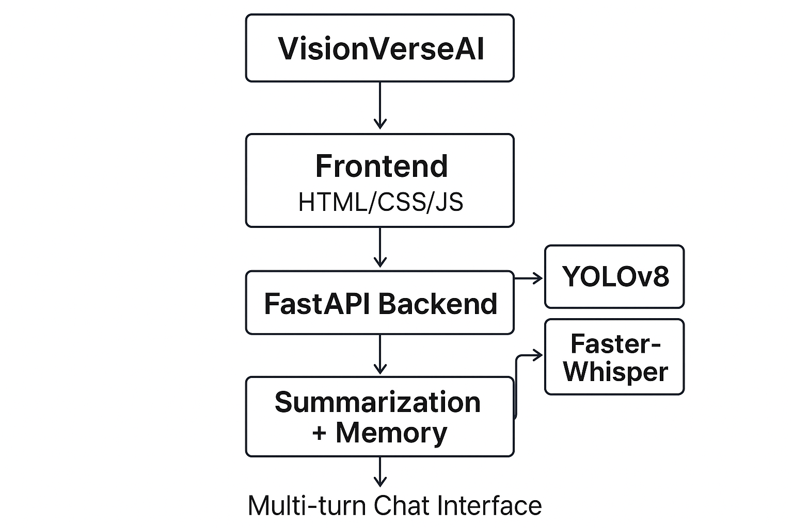

# VisionVerseAI – Round 2

# 🚦 VisionVerseAI - High-Performance, Scalable Visual Understanding Chat Assistant

**VisionVerseAI** is a high-performance visual understanding chat assistant designed to process **long-duration videos** with **low latency**, support **multi-turn conversations**, and scale efficiently for real-time applications.

> 📣 **Submitted for Mantra Hackathon 2025 – Round 2: High-Performance & Scalable Visual Understanding**  
> 🔥 **Team Name**: Phoenix  
>
> 👥 **Team Members**:
> - Gorla Sai Praneeth Reddy  
> - Polisetty Surya Teja  
> - Nabajyoti Chandra Deb  
>
> ✅ **Round 2 Highlights**  
> - 🚀 Optimized low-latency video analysis  
> - 🌐 Scalable backend using FastAPI  
> - 💬 Multi-turn context-aware chat engine  
> - ⚡ Robust error handling & reproducible setup  

---

## 📌 Problem Statement

The challenge was to build a **visual understanding assistant** that:  

- Processes **long video streams** with minimal latency  
- Provides **accurate event detection and summarization**  
- Supports **multi-turn conversational queries** with context  
- Ensures **scalability** for real-world deployments  

---

## 📌 Project Overview

For **Round 2**, we upgraded VisionVerseAI from short video support to a **robust system** capable of handling **long-duration videos (up to 120 minutes)** while maintaining:  

- **Low latency** (<1000ms inference)  
- **Accurate event detection** (vehicles, pedestrians, signals, audio events)  
- **Guideline adherence/violation summaries** with timestamps  
- **Context-aware chat** for follow-up queries  
- **Scalable backend design** for high throughput  

---

## 🧱 Architecture Diagram



**Flow**:  
1. User uploads a video and enters a query via **Frontend (HTML/CSS/JS)**  
2. **FastAPI Backend** receives the video, extracts frames, and performs detection  
3. **YOLOv8** detects objects/events (vehicles, pedestrians, signals, violations)  
4. **Faster-Whisper** transcribes audio into text  
5. **Summarization + Memory** combine results into structured logs  
6. **Multi-turn Chat Interface** lets users query specific parts of the video  

---

## 🧠 Tech Stack Justification

| Component          | Technology              | Justification |
|-------------------|--------------------------|---------------|
| **Backend**        | FastAPI + Python         | Async API, scalable, handles video & chat logic |
| **Frontend**       | HTML, CSS, JavaScript    | Lightweight and interactive UI |
| **Object Detection** | YOLOv8                 | Accurate, GPU-accelerated detection |
| **Audio Processing** | Faster-Whisper         | Fast, accurate transcription |
| **Chat Handling**  | Python + Context Memory  | Enables multi-turn conversational flow |
| **Deployment**     | Uvicorn                 | Scalable, high-performance server |

---

## ⚙️ Setup & Installation

### 1️⃣ Clone Repository
```bash
git clone https://github.com/saipraneeth88/VisionVerseAI-R2.git
cd VisionVerseAI-R2
```
### 2️⃣ Create virtual environment (recommended)
```
python -m venv venv
source venv/bin/activate     # macOS/Linux
venv\Scripts\activate        # Windows
```
### 3️⃣ Install dependencies
```
pip install -r requirements.txt
```
### 4️⃣ Start the server
```
uvicorn backend.main:app --host 0.0.0.0 --port 8080
```
### 5️⃣ Open the web interface
Open index.html from the frontend directory in your browser
OR
If integrated, visit http://localhost:8080 for the full interface.

## 📂 Project Structure
```
VisionVerseAI-R2/
├── backend/                # FastAPI backend
│   ├── main.py             # API entrypoint
│   ├── run.py              # Execution logic
│   ├── audio.py            # Audio transcription (Faster-Whisper)
│   ├── analysis.py         # Event/object detection logic
│   ├── vision.py           # Frame sampling & video handling
│   ├── schema.py           # Data models for metadata
│   └── requirements.txt    # Python dependencies
│
├── data/
│   ├── processed/          # Processed metadata
│   ├── temp/               # Temporary files
│   └── uploads/            # Uploaded videos
│
├── frontend/               # User interface
│   ├── index.html          # Main UI
│   ├── static/
│       ├── css/            # Stylesheets
│       ├── js/             # Client-side scripts
│       └── images/         # Logos & icons
│
├── architecture_diagram.png
└── README.md
```

## 📊 Evaluation Criteria Mapping
| **Criteria**                 | **Our Approach**                                                                            |
| ---------------------------- | ------------------------------------------------------------------------------------------- |
| **Latency**                  | Optimized frame sampling + GPU inference (YOLOv8 + Whisper) ensures <1000ms query responses |
| **Scalability**              | Backend built with FastAPI + Uvicorn, supports horizontal scaling                           |
| **Multi-turn Conversations** | Context memory preserves session history across queries                                     |
| **Long-duration Support**    | Efficient frame handling for videos up to 120 mins                                          |
| **Accuracy**                 | YOLOv8 for precise detection, Faster-Whisper for accurate audio transcription               |
| **Robustness**               | Error handling for missing frames/audio and retry logic                                     |
| **User Experience**          | Clean UI, real-time chat updates, structured logs with timestamps                           |

## 🏆 Challenges & Learnings

- Environment Stability – Solved by using Python 3.11 with pinned library versions.
- Latency vs Accuracy – Balanced by optimizing frame sampling and batch inference.
- Scalability – FastAPI backend + Uvicorn allows horizontal scaling.
- Reproducibility – Ensured through pinned dependencies and structured codebase.

## 📺 Watch our evaluation here:  
👉 [Demo Link (Google Drive)](https://drive.google.com/file/d/1Mb57OF3UN8ohV2P6BP9LtoOV1kn39UwZ/view?usp=drive_link)

## 🙋 Contact
Gorla Sai Praneeth Reddy - saipraneeth1806@gmail.com  
Polisetty Surya Teja - suryateja2031@gmail.com  
Nabajyoti Chandra Deb - nabajyotideb2017@gmail.com
